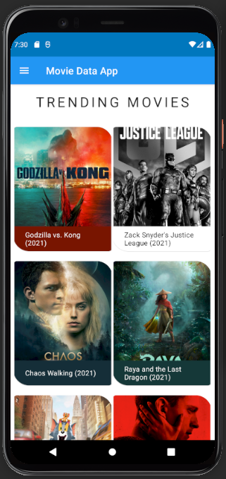
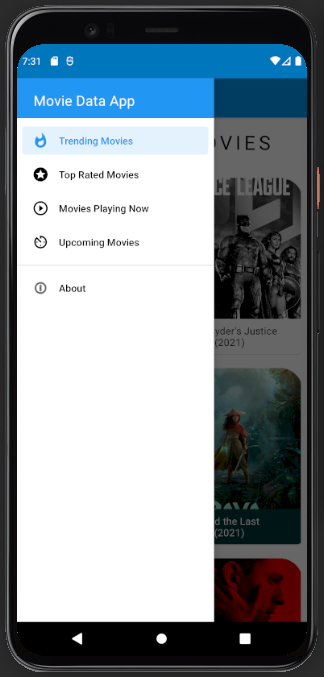
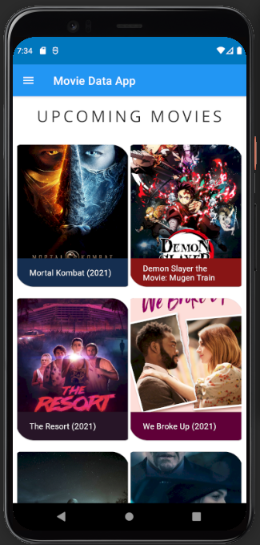
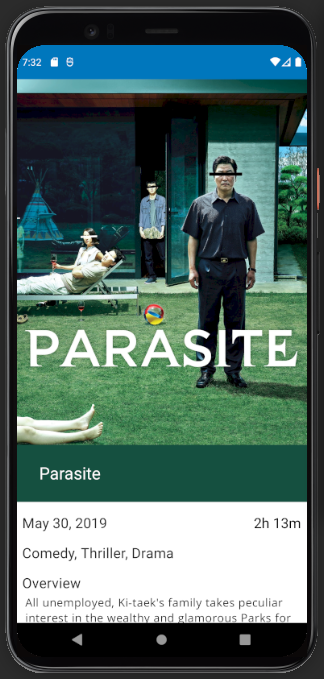
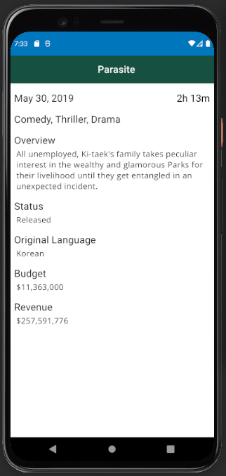
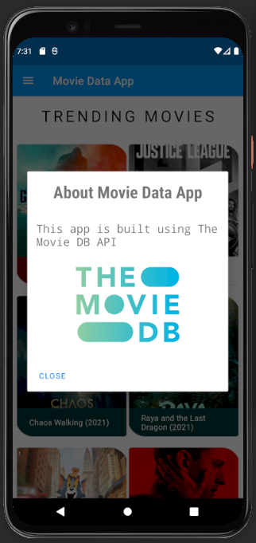

# Movie Data Android App
An android application written in Kotlin to get details of movies

## Snapshots

|           Home          |       Side Navigation        |       Home - Upcoming Movies     |
| :---------------------: | :--------------------------: | :-------------------------------:|
|  |  |  |

|           Movie          |           Movie Detail          |       About Dialog       |
| :----------------------: | :-----------------------------: | :-----------------------:|
|  |  |  |

## Overview
- The application shows the list of top trending movies, upcoming movies, top rated movies and movies playing now.
- All the data is used from [The Movie Database](https://themoviedb.org).
- Used Recyclerview with Grid Layout to show movies in the form of grids.
- Glide is used to load image.
- Used Data binding and view binding.
- Used material transition to load a movie.

## Built with
- Kotlin (Version: 1.4.30)
- [Retrofit](https://square.github.io/retrofit/) (Version: 2.9.0)
- [The Movie Db Api](https://themoviedb.org)
- [Glide](https://bumptech.github.io/glide/) (Version: 4.8.0)

---

 Made with :blue_heart: by <a href="https://github.com/i-vishi">Vishal Gaur</a>

